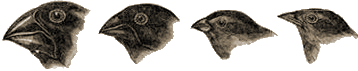

```{r setup, include=FALSE}
knitr::opts_chunk$set(echo = TRUE)
```

In the 1970s, biologists Peter and Rosemary Grant caught and measured all the birds from more than 20 generations of finches on the Galapagos island of Daphne Major. In one of those years, 1977, a severe drought caused vegetation to wither, and the only remaining food source was a large, tough seed, which the finches ordinarily ignored. Were the birds with larger and stronger beaks for opening these tough seeds more likely to survive that year, and did they tend to pass this characteristic to their offspring?



The data here are beak depths (height of the beak at its base) of 89 finches caught the year before the drought (1976) and 89 finches captured the year after the drought (1978).

Read and describe in data
-------------------------

```{r}
dat <- read.csv('finch-beaks.csv')
head(dat)
dim(dat)

table(dat$Year)
```

t-test: do the `1978` finches have larger beaks?
------------------------------------------------

```{r}
t.test(dat$Depth ~ dat$Year)
```
