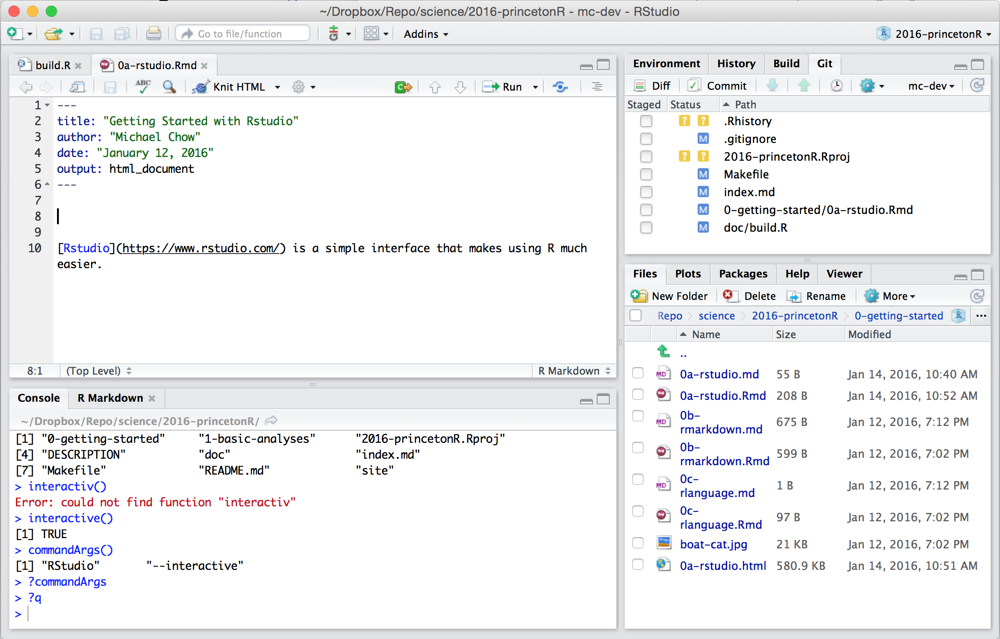

What is RStudio?
----------------
[Rstudio](https://www.rstudio.com/) is a simple interface that makes using R much easier.
It has separate panes for running R code, writing scripts and reports, and managing projects. This section will explain briefly what each pane in Rstudio contains.

Things to focus on:

1. Writing in interpreter (what is R code?)
2. Making an Rmarkdown document
3. Scripts
4. Looking at files
5. Working directory